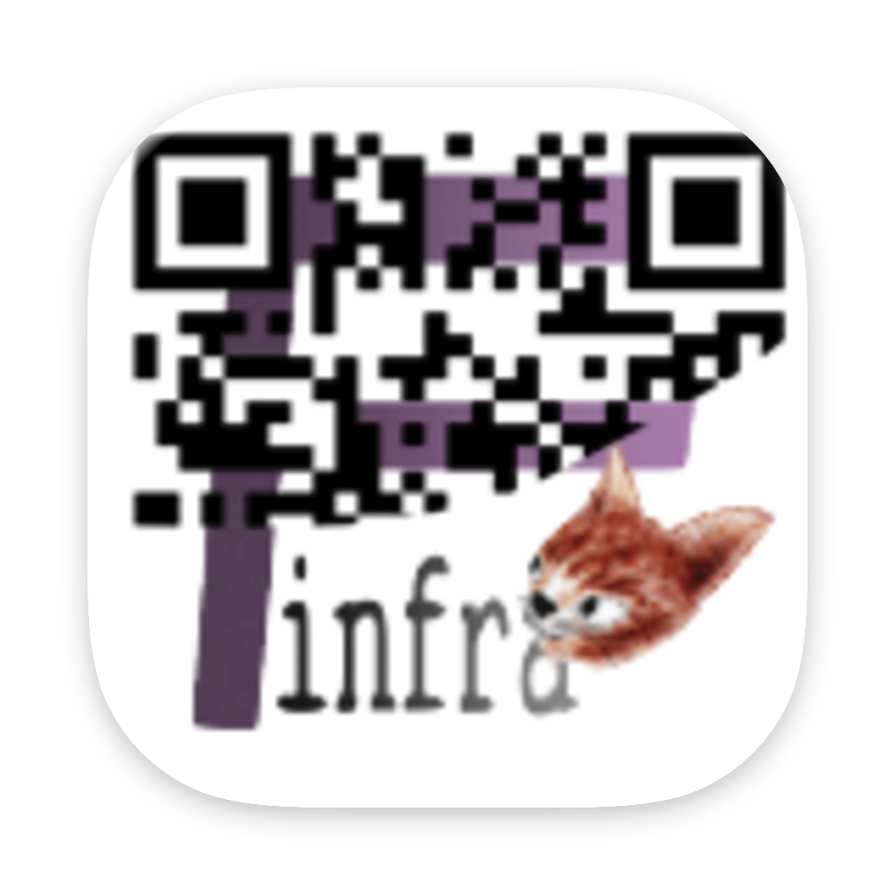

# fQRGen

 

> **AI연동 가능 QR Code생성기.**

macOS 메뉴바 QR 코드 생성기. 복사한 URL이나 텍스트를 즉시 QR 코드로 변환하며, REST API를 기본 지원합니다.

## 주요 기능

- **즉시 접근** - 메뉴바 아이콘에서 바로 QR 코드 생성
- **클립보드 자동화** - 복사한 URL/텍스트 자동 감지
- **다양한 포맷** - PNG (웹용) 및 SVG (인쇄용) 내보내기
- **QR 코드 히스토리** - 이전에 생성한 코드 재사용
- **설정 커스터마이징** - 다국어, 색상, 크기 설정
- **내장 REST API** - 프로그래밍 방식의 QR 코드 생성

## 요구 사항

- macOS 14.0 이상

## 제품 페이지

| 언어 | 링크 |
|------|------|
| English | [fQRGen - Product Page](http://finfra.kr/product/fQRGen/en/index.html) |
| 한국어 | [fQRGen - 제품 페이지](http://finfra.kr/product/fQRGen/kr/index.html) |

## Finfra 제품군

| 제품 | 링크 |
|------|------|
| Local LLM Agent Coding Support | [제품 페이지](https://finfra.kr/product/LocalLLMAgentCoding/en/index.html) |
| Mac App Development | [제품 페이지](https://finfra.kr/product/MacAppDev/en/index.html) |
| fSnippet | [제품 페이지](https://finfra.kr/product/fSnippet/en/index.html) |
| fWarrange | [제품 페이지](https://finfra.kr/product/fWarrange/en/index.html) |
| fBanner | [제품 페이지](https://finfra.kr/product/fBanner/en/index.html) |
| fBoard | [제품 페이지](https://finfra.kr/product/fBoard/en/index.html) |
| **fQRGen** | [제품 페이지](https://finfra.kr/product/fQRGen/en/index.html) |
| fGoogleSheet | [제품 페이지](https://finfra.kr/product/fGoogleSheet/en/index.html) |
| aWallet (DAPP) | [제품 페이지](https://jk7g14.github.io/2018/07/03/EtherMembership.html) |
| DeepFish (AI) | [제품 페이지](https://jk7g14.github.io/2017/10/16/Fish-Detection-DeepFish.html) |

## 문서

| 문서 | 설명 |
|------|------|
| [매뉴얼](./manual/) | 사용자 매뉴얼 (한국어/영어) |
| [REST API](./api/) | REST API 레퍼런스 및 OpenAPI 스펙 |
| [MCP 서버](./mcp/) | Model Context Protocol 서버 |
| [Claude Code 스킬](./agents/claude/) | Claude Code 플러그인 |
| [다국어 리소스](./localization/) | 다국어 문자열 리소스 (8개 언어) |

## 커뮤니티 및 지원

### 이슈
- [GitHub Issues](https://github.com/Finfra/fQRGen_public/issues)

### 게시판 (English)
| 분류 | 링크 |
|------|------|
| Notice | [fQRGen Notice](https://finfra.kr/w1/category/fqrgen-notice/) |
| Guide | [fQRGen Guide](https://finfra.kr/w1/category/fqrgen-guide/) |
| QnA | [fQRGen QnA](https://finfra.kr/w1/category/fqrgen-qna/) |
| Feedback | [fQRGen Feedback](https://finfra.kr/w1/category/fqrgen-feedback/) |

### 게시판 (한국어)
| 분류 | 링크 |
|------|------|
| 공지 | [fQRGen 공지](https://finfra.kr/w1/category/fqrgen-notice-kr/) |
| 사용법 | [fQRGen 사용법](https://finfra.kr/w1/category/fqrgen-guide-kr/) |
| QnA | [fQRGen QnA](https://finfra.kr/w1/category/fqrgen-qna-kr/) |
| 피드백 | [fQRGen 피드백](https://finfra.kr/w1/category/fqrgen-feedback-kr/) |

## 라이선스

Copyright (c) finfra.kr. All rights reserved.
